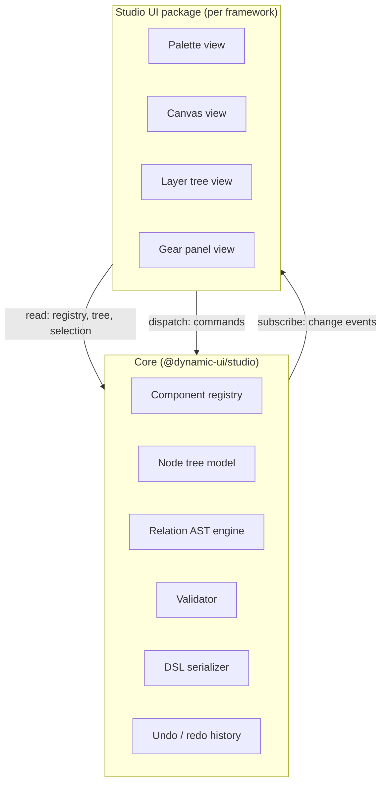

# Architecture

This document describes how Dynamic UI is put together: the layers, how they communicate, and what each one is responsible for.

For the "what and why", see the [root README](README.md).
For the core library in detail, see the [core README](libs/studio/README.md).

---

## System overview

Dynamic UI is a chain of four responsibilities, each one framework-agnostic in itself:

```mermaid
graph LR
    Dev[Developer<br/>registers components]
    Mgr[Manager / designer<br/>uses studio]
    Core[Core<br/>&#64;dynamic-ui/studio]
    UI[Studio UI<br/>per-framework package]
    DSL[(Canonical DSL<br/>pure JSON)]
    Adp[Adapter<br/>per runtime target]
    RT[Runtime form library<br/>RHF / Formily / Angular RF]
    End[End user<br/>fills the real form]

    Dev -->|component registry| Core
    Core <-->|model + commands| UI
    Mgr -->|interacts| UI
    UI -->|export| DSL
    DSL -->|load| Adp
    Adp -->|renders| RT
    RT --> End
```



Key properties of this chain:

- **The DSL is the only hand-off between the studio side and the runtime side.** Everything upstream of the DSL is "editor concerns". Everything downstream is "runtime concerns". They are developed, versioned, and tested independently.
- **Core has no UI; UI has no runtime; runtime has no editor.** No layer reaches past its neighbours.
- **Adapters are the only place where a specific form library is named.** The core, the UI packages, and the DSL itself know nothing about React Hook Form, Formily, or anything else.

---

## Studio UI anatomy

The studio UI is a three-panel editor. Each panel has one job.

```
┌───────────────────────────────────────────────────────────────────────┐
│                              TOP BAR                                  │
│  [ Project ▾ ]       [ ⟲ Undo ][ ⟳ Redo ]       [ Export DSL ]  [ ⋯ ] │
├────────────────┬───────────────────────────────────┬──────────────────┤
│                │                                   │                  │
│  COMPONENT     │                                   │   LAYER TREE     │
│  PALETTE       │             CANVAS                │   (Figma-like)   │
│  (Storybook-   │                                   │                  │
│   like)        │     abstract node cards           │   ▾ Form         │
│                │     draggable · selectable        │     ▾ Row        │
│  Controls      │                                   │       • Email ✓  │
│   • TextInput  │   ┌─────────────────────────┐     │       • Password │
│   • Checkbox   │   │ TextInput          ⚙    │     │     ▾ Section    │
│   • Dropdown   │   │ "Email"                 │     │       • Role     │
│   • Radio      │   │ required when role=admin│     │       • Country  │
│                │   └─────────────────────────┘     │     • Submit     │
│  Containers    │                                   │                  │
│   • Form       │   ┌─────────────────────────┐     ├──────────────────┤
│   • Row        │   │ Dropdown           ⚙    │     │                  │
│   • Stepper    │   │ "Role"                  │     │   GEAR           │
│   • Card       │   └─────────────────────────┘     │   (selected node)│
│                │                                   │                  │
│  (user-        │                   ┌───────────┐   │   Props          │
│   registered   │                   │ Dropzone  │   │     label  Email │
│   kinds)       │                   └───────────┘   │     maxLen 120   │
│                │                                   │   Relations      │
│                │                                   │     required ⚡  │
│                │                                   │     visible   —  │
└────────────────┴───────────────────────────────────┴──────────────────┘
```

### Left: component palette

A flat, searchable list of every component the developer has registered. Grouping is cosmetic — the core sees only a flat registry; the UI chooses how to present it (by prefix in `name`, by metadata, etc.).

Items drag onto the canvas or into the tree. Dragging an item of a `kinds`-restricted type over an incompatible drop target is visually rejected.

Behaves like Storybook's left sidebar: searchable, hierarchical by convention, no component previews (because the core has no way to render them — this is the whole point).

### Center: canvas

Shows the current tree as **abstract cards**, not as the rendered UI. Each card shows:

- Component name and (if set) a human label.
- A one-line summary of each configured relation (so the manager can see dependencies at a glance).
- A gear button that focuses the right-side gear panel on this node.

Drag reorders siblings; drop into a container appends a child, subject to the container's `cardinality` and `kinds` constraints.

**The canvas does not render actual form controls.** It never will. That is the central architectural rule of this project (see "Load-bearing invariants" below).

### Right: layer tree + gear

Upper half: a Figma-style layer tree. Full tree view, expand/collapse, drag-to-reorder, right-click actions. This is the primary navigation surface for large forms where the canvas becomes long.

Lower half: the gear panel for whichever node is selected. Rendered from the component's declared `props` and `relations` metadata — one row per primitive, grouped as declared.

The split is adjustable (resizer between tree and gear); users who live in the tree can collapse the gear, users who live in the gear can collapse the tree.

### Top bar

Project name / schema switcher, undo/redo, export (download or copy the DSL), menu. Zero business logic — all actions dispatch core commands.

---

## Core / UI contract

The core is a pure state container. The UI is a view that dispatches commands and renders state. This is a deliberately classical split (model-view, store-and-subscribe) because it is boring, well-understood, and framework-portable.



### What the core exposes

- **Registry API**: `register(component)`, `getComponents()`, `getComponent(name)`.
- **Tree queries**: `getTree()`, `getNode(id)`, `getParent(id)`, `getSelection()`.
- **Commands** (every mutation is a named command, so history and middlewares are trivial):
  - `addNode({ parentId, name, index })`
  - `removeNode({ id })`
  - `moveNode({ id, newParentId, newIndex })`
  - `setProp({ nodeId, path, value })`
  - `setRelation({ nodeId, name, ast })`
  - `select({ id })`
  - `undo()` / `redo()`
- **Subscriptions**: `onChange(cb)`, scoped channels for tree, selection, specific node ids.
- **Serialization**: `toDSL()`, `fromDSL(json)`.
- **Validation**: `validate()` (full), `validateNode(id)`.

The exact API is still being iterated. The important part is the shape: commands in, state out, events on change. No DOM, no framework.

### What the UI package does

- Renders the three panels described above using the host framework's conventions.
- Translates user interactions (clicks, drags, keystrokes) into core commands.
- Subscribes to core events and re-renders affected regions.
- Owns zero business state. If a piece of state would need to survive refresh, it belongs in the core.

**The only state the UI legitimately owns is view state**: panel sizes, scroll positions, which tree nodes are expanded, modal visibility. Everything that is part of the design lives in the core.

---

## Data flow for a typical interaction

Example: a manager drags `TextInput` from the palette into a `Form` container, then edits its label and sets a `required` relation.

```mermaid
sequenceDiagram
    actor Mgr as Manager
    participant Palette
    participant Canvas
    participant Gear
    participant Core

    Mgr->>Palette: drag "TextInput"
    Palette->>Canvas: drop over Form container
    Canvas->>Core: addNode({ parent: form-1, name: "Controls/TextInput" })
    Core-->>Canvas: event: tree changed; new id: field-7
    Core-->>Tree: event: tree changed
    Mgr->>Canvas: click gear on field-7
    Canvas->>Core: select({ id: field-7 })
    Core-->>Gear: event: selection changed
    Gear->>Core: getNode(field-7) + getComponent("Controls/TextInput")
    Gear-->>Mgr: render props + relations rows
    Mgr->>Gear: type "Email" into label
    Gear->>Core: setProp({ nodeId: field-7, path: "label", value: "Email" })
    Core-->>Canvas: event: node changed
    Mgr->>Gear: configure required relation (role == admin)
    Gear->>Core: setRelation({ nodeId: field-7, name: "required", ast: {...} })
    Core-->>Canvas: event: node changed (relation summary updates on card)
```

Every arrow from UI to core is a named command. Every arrow back is a subscription event. There are no direct view-to-view communications.

---

## DSL lifecycle

The DSL is the one thing that crosses the studio / runtime boundary.

```mermaid
graph LR
    Edit[Editing session]
    Save[(Storage<br/>JSON file / DB)]
    Load[Load into app]
    Adp[Adapter]
    RT[Runtime library]

    Edit -->|toDSL &#124; export| Save
    Save -->|fetch at runtime| Load
    Load --> Adp
    Adp --> RT
    Save -->|fromDSL| Edit
```



Guarantees provided by the core:

- `fromDSL(toDSL(tree))` is lossless.
- `toDSL(tree)` is deterministic (stable key order, stable id ordering) so it diffs cleanly in review.
- The DSL carries `schemaVersion`. Migrations from older versions are mechanical and shipped with the core.
- Validation runs on `fromDSL` with configurable strictness: strict (reject unknown operators), lenient (preserve unknown operators as opaque blobs for forward compatibility).

Nothing in the DSL is framework-specific. The same JSON file is consumed by a React adapter in one project and an Angular adapter in another.

---

## Package layout and responsibilities

| Package                                | Responsibility                                 | Framework-dependent? | Status      |
| -------------------------------------- | ---------------------------------------------- | -------------------- | ----------- |
| `@dynamic-ui/studio`                   | Core logic, DSL, validation, history           | No                   | In progress |
| `@dynamic-ui/studio-ui-react`          | React implementation of the three-panel editor | Yes                  | Planned     |
| `@dynamic-ui/studio-ui-angular`        | Angular implementation                         | Yes                  | Planned     |
| `@dynamic-ui/studio-ui-vue`            | Vue implementation                             | Yes                  | Planned     |
| `@dynamic-ui/adapter-react-hook-form`  | Reference adapter                              | Yes                  | Planned     |
| `@dynamic-ui/adapter-angular-reactive` | Reference adapter                              | Yes                  | Planned     |

A consumer picks exactly one UI package (matching their stack) and exactly one adapter (matching their runtime). Both are optional in principle — a programmatic-only user who writes DSL by hand needs only `@dynamic-ui/studio` and an adapter; a design-only user who hands off JSON to someone else needs only the core and a UI package.

---

## Load-bearing invariants

Repeating these here because they constrain every architectural decision:

1. **Studio renders abstract DSL cards, not real forms.** The canvas never attempts to render registered components as working UI. The moment it does, the core has to pick a runtime, and the entire adapter abstraction collapses.
2. **The DSL is pure data.** No functions, closures, class instances, Symbols. Anything that fails a `JSON.parse(JSON.stringify(x))` round-trip does not belong in the DSL.
3. **Runtime capability mismatches are adapter concerns.** The DSL may describe behaviors that a particular runtime cannot express. That is the runtime's limit, not the DSL's bug.
4. **Everything is a component.** No built-in categories (inputs, containers, validators, forms). Any such concept is expressed by a developer-registered component plus its props, relations, and children configuration.

Any PR that erodes one of these should be challenged on exactly those grounds.
